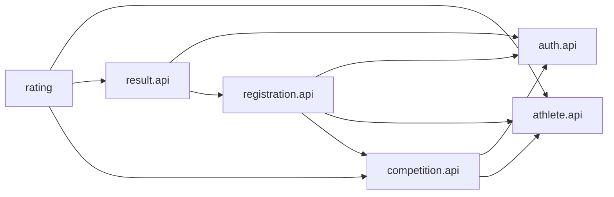

# Архитектура FSP Project

## 1. Архитектурное решение

Для первой промышленной версии проект реализуется как **модульный монолит** на Java 17, Spring Boot, Spring Data JPA, Spring Security, PostgreSQL и Flyway.

Это одно разворачиваемое приложение и одна база данных, но код разделён на бизнес-модули с явными границами. Модуль не обращается напрямую к внутренним классам другого модуля. Взаимодействие выполняется через небольшой публичный API модуля и синхронные события приложения.

Микросервисы на текущем этапе не применяются. Они усложнят транзакции, авторизацию, развёртывание, наблюдаемость и работу команды, не давая полезного выигрыша для существующей нагрузки.

## 2. Оценка текущего состояния

### Что уже сделано правильно

- Код разделён по функциям `competition` и `rating`, а не собран в общие глобальные слои.
- Контроллеры используют DTO и не возвращают JPA-сущности.
- Бизнес-правила соревнования находятся в предметной модели, а не только в контроллере.
- Используются Bean Validation, транзакции, `Clock`, пагинация и версия формулы рейтинга.
- Для соревнования предусмотрены проверка владельца, допустимые переходы состояния и защита от потерянного обновления.
- `RatingSnapshot` хранит объяснимые составляющие рейтинга и версию формулы.

### Критические проблемы

1. Проект сейчас не является целостным Spring Boot-приложением. `Main` — демонстрационный класс IntelliJ без `@SpringBootApplication`.
2. Код импортирует отсутствующие классы:
   - `com.codeandpray.common.exception.BusinessException`;
   - `com.codeandpray.common.security.CurrentActor`;
   - `com.codeandpray.common.web.PageResponse` и `PageRequests`;
   - `competition.port.DisciplineDirectory` и `CompetitionParticipation`;
   - `rating.port.RatingDataPort`.
3. В репозитории нет миграций Flyway, `application.yml`, конфигурации безопасности и тестов.
4. Нет Maven Wrapper, поэтому сборка зависит от установленного на компьютере Maven.
5. Слой предметной модели зависит от Spring Security: сущность `Competition` бросает `AccessDeniedException`. Домен не должен знать о HTTP или Spring Security.
6. `rating` импортирует внутренний enum модуля `competition`, а сервисы ссылаются на несуществующие потребительские `port`-интерфейсы. Границы модулей не закреплены.
7. Текущий рейтинг определяется по максимальному `id`, хотя в проектном документе указан порядок `(calculatedAt DESC, id DESC)`.
8. Таблица лидеров ищет последний снимок каждого спортсмена через коррелированный `NOT EXISTS`. По мере роста истории этот запрос станет дорогим.
9. Повторный запуск пересчёта создаёт ещё один одинаковый снимок. Нет идентификатора причины пересчёта и защиты от повторной обработки события.
10. Нет единого контракта ошибок, аудита, OpenAPI, автоматической сборки и архитектурных тестов.

Текущая реализация — хорошая предметная заготовка, но ещё не готовая к выпуску система.

## 3. Правило структуры каждого модуля

Каждый бизнес-модуль использует одинаковую структуру:

```text
<module>/
  api/              публичные контракты для других модулей
  application/      пользовательские сценарии и границы транзакций
    command/        операции, изменяющие состояние
    query/          операции чтения
    event/          обработчики событий других модулей
  domain/           сущности, value object, правила и доменные исключения
  infrastructure/   Spring, JPA, HTTP и другие технические адаптеры
    persistence/
    web/
    config/
```

Для небольшого модуля подпапки `command` и `query` можно не создавать. Слои не должны состоять из пустых каталогов: структура расширяется по мере появления классов.

### Направление зависимостей

```text
web/persistence/config -> application -> domain
другой модуль          -> module.api
domain                 -> только Java, без Spring MVC и Spring Security
```

Публичным считается только пакет `<module>.api`. Пакеты `domain`, `application` и `infrastructure` другого модуля импортировать запрещено.

## 4. Целевая структура проекта

```text
src/main/java/com/codeandpray/
  FspApplication.java

  common/
    config/
      ClockConfiguration.java
      JacksonConfiguration.java
    error/
      ApiError.java
      ErrorCode.java
      ApplicationException.java
      GlobalExceptionHandler.java
    security/
      CurrentUser.java
      SecurityConfiguration.java
    web/
      PageResponse.java

  auth/
    api/
    application/
    domain/
    infrastructure/persistence/
    infrastructure/web/

  athlete/
    api/
    application/
    domain/
    infrastructure/persistence/
    infrastructure/web/

  competition/
    api/
    application/
    domain/
    infrastructure/persistence/
    infrastructure/web/

  registration/
    api/
    application/
    domain/
    infrastructure/persistence/
    infrastructure/web/

  result/
    api/
    application/
    domain/
    infrastructure/persistence/
    infrastructure/web/

  rating/
    api/
    application/
    domain/
    infrastructure/persistence/
    infrastructure/web/

src/main/resources/
  application.yml
  application-local.yml
  application-prod.yml
  db/migration/

src/test/java/com/codeandpray/
  architecture/
  <module>/
```

`common` содержит только действительно общую техническую инфраструктуру. Нельзя переносить туда сущности, бизнес-сервисы или DTO одного конкретного модуля.

## 5. Модули и владельцы

| Модуль | Владелец | Ответственность |
|---|---|---|
| `auth` и `common` | Шамиль | Пользователь, вход, роли, Spring Security, текущий пользователь, единые ошибки и пагинация |
| `athlete` | Ася | Профиль, организации, дисциплины, квалификации и их справочники |
| `competition` | Магомед | Создание, редактирование, отмена и завершение соревнований |
| `registration` | Шамиль | Подача, отмена/восстановление заявки и список участников |
| `result` | Ася | Черновик, редактирование и публикация результата |
| `rating` | Магомед | Формула, пересчёт, история и таблица лидеров |
| интеграция и демонстрация | Шамиль, с проверкой всей команды | Миграции, конфигурация запуска, seed-данные, сквозной сценарий и README |

Владение модулем означает владение его таблицами, миграциями, публичным API и тестами. Общие файлы изменяются отдельным согласованным pull request либо ответственным за интеграцию.

## 6. Публичные контракты модулей

Интерфейс, необходимый другим частям системы, создаёт **модуль-поставщик**, а не потребитель.

Примеры контрактов:

```java
// athlete/api/AthleteQueryService.java
public interface AthleteQueryService {
    boolean exists(long athleteId);
    AthleteRatingData getRatingData(long athleteId);
}

public record AthleteRatingData(long athleteId, long qualificationBonus) {}
```

```java
// registration/api/RegistrationQueryService.java
public interface RegistrationQueryService {
    boolean competitionHasRegistrations(long competitionId);
    RegistrationView requireRegistration(long registrationId);
}
```

```java
// result/api/PublishedResultQueryService.java
public interface PublishedResultQueryService {
    List<PublishedResultView> findPublishedByAthlete(long athleteId);
}
```

```java
// competition/api/CompetitionQueryService.java
public interface CompetitionQueryService {
    CompetitionRatingData requireRatingData(long competitionId);
}
```

Контракт возвращает immutable `record` с минимально необходимыми данными. Он не возвращает JPA-сущность или репозиторий.

Текущие `DisciplineDirectory`, `CompetitionParticipation` и `RatingDataPort` не следует оставлять как временные заглушки внутри потребляющих модулей. Их нужно заменить публичными API модулей-владельцев после согласования названий и методов.

## 7. Карта зависимостей



Циклические зависимости запрещены. В частности, `result` не должен напрямую вызывать `rating`, если `rating` одновременно читает `result`.

Для пересчёта используются синхронные события:

```text
ResultApplicationService публикует ResultPublishedEvent
Rating обработчик события читает опубликованные результаты
Rating сохраняет новый рейтинг в той же транзакции
```

Аналогично `athlete` публикует `QualificationChangedEvent`. Обычный синхронный Spring `ApplicationEventPublisher` достаточен: если пересчёт завершился ошибкой, вся транзакция откатывается. Для будущего разделения на микросервисы события можно перевести на transactional outbox.

Каждое событие содержит уникальный `eventId`. Обработанный `eventId` фиксируется или используется как уникальный ключ пересчёта, чтобы повторная доставка не создавала дубли.

## 8. Модель данных и границы JPA

Внутри одного модуля допустимы обычные JPA-связи. Между модулями рекомендуется хранить идентификаторы и обеспечивать реальные внешние ключи в PostgreSQL:

| Таблица | Межмодульные ссылки |
|---|---|
| `competitions` | `discipline_id`, `created_by_user_id` |
| `registrations` | `competition_id`, `athlete_id` |
| `results` | `registration_id`, `entered_by_user_id` |
| `rating_snapshots` | `athlete_id` |

Это предотвращает загрузку больших графов Hibernate, циклическую сериализацию и прямую зависимость Java-сущностей разных модулей. Целостность данных при этом сохраняется внешними ключами БД.

### Владение миграциями

- Один участник не редактирует уже применённую миграцию другого участника.
- Номера миграций резервируются заранее в командном чате.
- Изменение схемы добавляется новой миграцией.
- `spring.jpa.hibernate.ddl-auto=validate` для production-профиля; Hibernate проверяет схему, но не создаёт её.
- Миграции содержат FK, `UNIQUE`, `CHECK` и индексы, а не только создание таблиц.

Минимальные индексы:

```text
competitions(status, starts_at)
competitions(discipline_id, starts_at)
competitions(created_by_user_id)
registrations(competition_id, status)
registrations(athlete_id, registered_at)
UNIQUE registrations(competition_id, athlete_id)
UNIQUE results(registration_id)
rating_snapshots(athlete_id, calculated_at DESC, id DESC)
```

## 9. Рейтинг для рабочей нагрузки

История и текущая таблица лидеров имеют разные задачи. Для релизной версии рекомендуется:

- `athlete_ratings` — одна текущая строка на спортсмена для быстрого leaderboard;
- `rating_snapshots` — неизменяемая история пересчётов.

Обе записи обновляются одной транзакцией. `athlete_ratings` имеет `athlete_id` как `PRIMARY KEY`, `version` для optimistic locking и индекс `(total_points DESC, athlete_id)`.

Если команда сохраняет только `rating_snapshots`, текущий снимок нужно выбирать по `(calculated_at DESC, id DESC)`, а запрос leaderboard обязательно проверить на PostgreSQL с `EXPLAIN ANALYZE`. Для небольшого MVP это допустимо, для растущей истории — нет.

Формулу рейтинга следует отделить от Spring и JPA. `RatingCalculator` остаётся чистым Java-классом и покрывается параметризованными unit-тестами. Коэффициенты либо фиксируются версией формулы в коде, либо хранятся как версионированные правила; смешивать два подхода нельзя.

## 10. API и безопасность

### Общие правила API

- Базовый путь: `/api/v1`.
- JSON использует один формат времени ISO-8601 в UTC.
- Списки возвращают единый `PageResponse<T>`.
- Ошибки возвращают единый `ApiError` с полями `code`, `message`, `fieldErrors`, `traceId`, `timestamp`.
- API документируется через OpenAPI и проверяется вместе с фронтендом.
- Версия объекта при обновлении передаётся единообразно: либо во всех update DTO, либо через HTTP `If-Match`. Для команды проще оставить поле `version` в DTO.
- Действия над состоянием выражаются командами: `/cancel`, `/start`, `/complete`, а не произвольной установкой любого статуса клиентом.

### Безопасность

- Клиент никогда не передаёт роль, владельца, `athleteId` или `enteredByUserId` для действий от собственного имени.
- Эти значения извлекаются из проверенной аутентификации.
- Пароли хранятся только как BCrypt/Argon2-хеши.
- Доступ контролируется на URL и повторно проверяется в application service.
- Проверка владельца выполняется в application/domain service и бросает предметное исключение. Преобразование в HTTP `403` делает `GlobalExceptionHandler`.
- Секреты и пароли БД поступают через переменные окружения; их нет в Git.
- Для cookie-сессии сохраняется CSRF-защита. Для stateless bearer-токена принимается отдельное документированное решение.

## 11. Транзакции и конкурентность

- `@Transactional` размещается на application service, а не на контроллере.
- Чтение помечается `readOnly = true`.
- `@Version` используется для обычных пользовательских изменений.
- Пессимистическая блокировка применяется только для доказанного конкурентного сценария. Одновременное использование `@Version` и `PESSIMISTIC_WRITE` в каждом обновлении избыточно.
- Публикация результата, фиксация баллов и обновление рейтинга выполняются одной транзакцией.
- Повторная публикация и повторное событие должны быть идемпотентными.
- `saveAndFlush()` применяется только когда немедленный SQL действительно нужен; обычно достаточно `save()` и flush при commit.

## 12. Тестовая стратегия

Каждый модуль обязан содержать:

1. **Unit-тесты домена** — правила дат, переходы статусов, формула рейтинга.
2. **Application-тесты** — права, оркестрация и реакции на ошибки с подменёнными API других модулей.
3. **Repository-тесты** через `@DataJpaTest` и PostgreSQL Testcontainers. H2 не должен быть единственной проверкой SQL и ограничений PostgreSQL.
4. **Web-тесты** через MockMvc: валидация, роли, коды и JSON ошибок.
5. **Интеграционные тесты** основного пути: спортсмен → заявка → результат → рейтинг.
6. **Архитектурные тесты** ArchUnit: запрет импортов внутренних пакетов чужого модуля и зависимостей domain от web/security/persistence.

Минимальные проверки CI для каждого pull request:

```text
compile -> unit tests -> integration tests -> architecture tests -> package
```

## 13. Эксплуатационная готовность

До первого релиза добавить:

- Maven Wrapper (`mvnw`, `mvnw.cmd`, `.mvn/wrapper`);
- отдельные профили `local`, `test`, `prod`;
- Docker Compose для PostgreSQL и локального запуска;
- Spring Boot Actuator с закрытыми служебными endpoint;
- структурированные логи и `traceId` в ошибках;
- GitHub Actions для сборки и тестов;
- OpenAPI;
- README с запуском, переменными окружения, тестовыми пользователями и demo-flow;
- резервное копирование БД и план применения/отката релиза.

Не нужно добавлять Kubernetes, Kafka, service discovery и распределённый tracing до появления реальной необходимости.

## 14. Порядок перехода от текущего проекта

### Этап 1 — восстановить собираемость

1. Заменить `Main` на `FspApplication` с `@SpringBootApplication`.
2. Добавить Maven Wrapper.
3. Создать минимальные `common.error`, `common.web`, `common.security`.
4. Удалить импорты несуществующих `port` либо заменить их согласованными API модулей-поставщиков.
5. Добавить `application-local.yml`, первую миграцию и локальный PostgreSQL.
6. Добиться успешного `./mvnw test` на чистом клоне.

### Этап 2 — закрепить границы

1. Переместить соревнования и рейтинг в целевую структуру `api/application/domain/infrastructure`.
2. Убрать зависимости домена от Spring Security и HTTP-исключений.
3. Определить публичные API всех модулей.
4. Добавить ArchUnit-тесты.

### Этап 3 — подключить модули команды

1. Слить `auth/common`.
2. Слить `athlete` и его публичные query-контракты.
3. Слить `competition`.
4. Слить `registration`.
5. Слить `result` и события публикации.
6. Подключить `rating` к событиям и query API.
7. Добавить сквозной интеграционный тест.

### Этап 4 — подготовить релиз

1. Проверить миграции на новой PostgreSQL.
2. Запустить тесты безопасности и основного сценария.
3. Добавить мониторинг, документацию API и CI.
4. Провести демонстрацию с чистого окружения по README.

## 15. Definition of Done для модуля

Модуль считается готовым, если:

- он имеет документированную ответственность и владельца;
- наружу доступны только классы из `api`;
- контроллеры не содержат бизнес-логику;
- сущности не возвращаются из REST;
- бизнес-правила защищены unit-тестами;
- таблицы создаются Flyway-миграциями с ограничениями и индексами;
- права проверяются сервером;
- ошибки используют общий формат;
- сборка проходит на чистом клоне через Maven Wrapper;
- нет импортов внутренних классов других модулей;
- изменение проверено интеграционным сценарием;
- pull request просмотрен хотя бы одним участником команды.

## 16. Решения, которые команда должна утвердить до продолжения

1. Подтвердить модульный монолит и перечисленные владельцы модулей.
2. Выбрать способ аутентификации: cookie-сессия либо bearer-токен.
3. Утвердить публичные query API и события между модулями.
4. Назначить ответственного за `common`, миграции и интеграцию.
5. Решить, хранить ли текущий рейтинг в `athlete_ratings` вместе с историей.
6. Зафиксировать версию формулы рейтинга и коэффициенты.
7. Утвердить единый формат ошибок, пагинации и версий объектов.
8. Заблокировать прямые push в `main`; изменения объединять через pull request и обязательную успешную CI-проверку.
