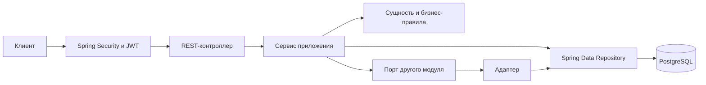
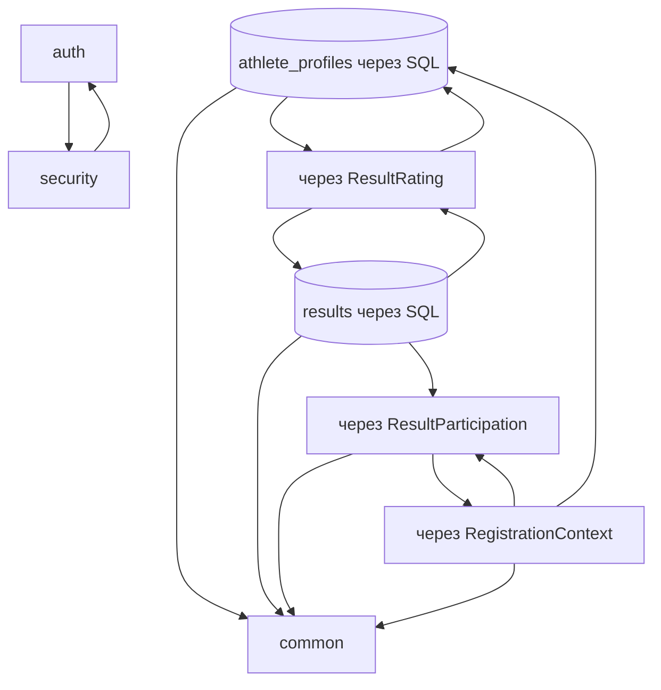
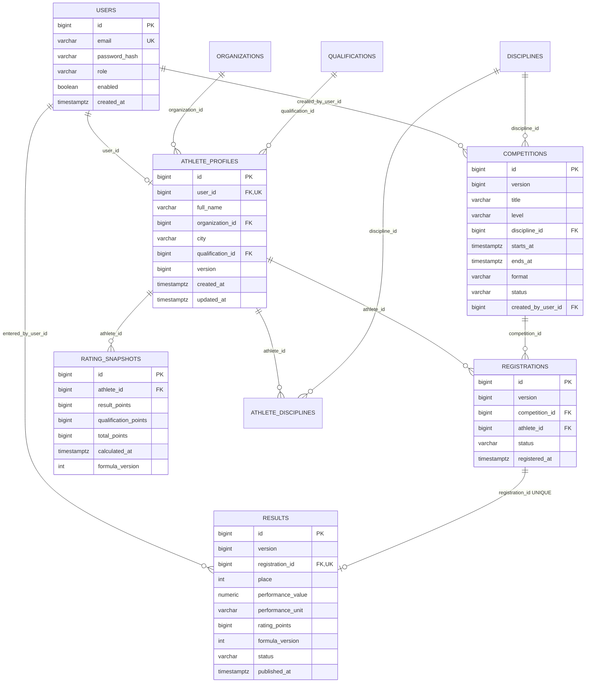
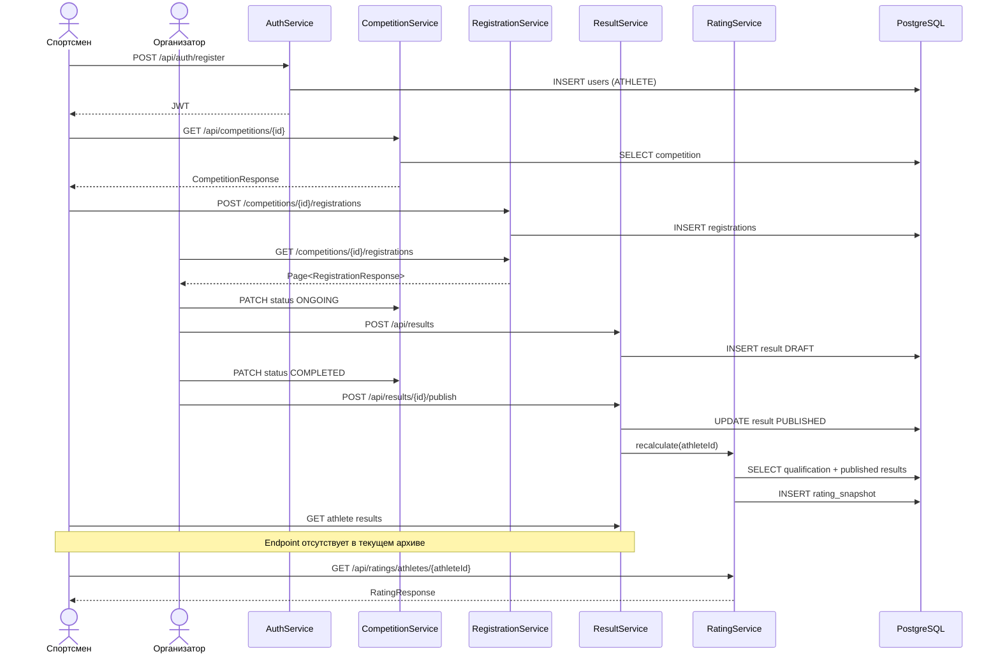

# FSP Project — техническая документация

Документ описывает состояние исходников из `D:\проект\src.zip`, полученных 26 сентября 2026 года. В архиве находится 94 Java-файла: 92 файла приложения и 2 тестовых класса.

Проверка этой версии: проект компилируется на Java 17; выполнено 9 тестов, ошибок и падений нет (`BUILD SUCCESS`). Эти тесты не проверяют весь сквозной сценарий.

## 1. Назначение системы

FSP Project — backend спортивной платформы. Пользователь регистрируется как спортсмен, создаёт профиль, просматривает соревнования и подаёт заявки. Организатор управляет своими соревнованиями и результатами. После публикации результата система пересчитывает рейтинг спортсмена.

Технологии:

- Java 17;
- Spring Boot 3;
- Spring Web MVC;
- Spring Security и JWT;
- Spring Data JPA и Hibernate;
- PostgreSQL;
- Flyway;
- Maven;
- Lombok;
- JUnit 5, MockMvc и H2 для тестов.

## 2. Архитектурный стиль

Приложение является модульным монолитом. Код разделён по предметным областям: `auth`, `athlete`, `competition`, `registration`, `result`, `rating`. Внутри модулей используются контроллеры, сервисы, сущности, репозитории, DTO, мапперы, порты и адаптеры.

Типичный путь запроса:

Порты уменьшают прямую связанность модулей. Например, `CompetitionService` не обращается к репозиторию дисциплин напрямую, а использует `DisciplineDirectory`; модуль `athlete` предоставляет реализацию через `DisciplineDirectoryAdapter`.

## 3. Модули и ответственность

| Модуль | Ответственность |
|---|---|
| `auth` | Регистрация спортсмена, вход, хранение пользователя и роли |
| `security` | JWT, загрузка пользователя, права доступа, ответы 401/403 |
| `athlete` | Профиль спортсмена и справочники организаций, квалификаций, дисциплин |
| `competition` | Создание, просмотр, изменение и жизненный цикл соревнования |
| `registration` | Подача и отмена заявки, списки заявок спортсмена и соревнования |
| `result` | Черновики результатов, публикация, исправление и удаление |
| `rating` | Расчёт баллов, снимки рейтинга, история и таблица лидеров |
| `common` | Время, ошибки, текущий пользователь, пагинация |

## 4. Связи между модулями

Типы связей:

- **Dependency / использование** — контроллер использует сервис, сервис использует репозиторий или маппер.
- **Implementation / реализация интерфейса** — адаптер реализует порт другого модуля.
- **Association / ассоциация** — объект хранит идентификатор другого объекта, например `Registration.competitionId`.
- **JPA Many-to-One** — `AthleteProfile` ссылается на `Organization` и `Qualification`.
- **Database foreign key** — таблицы связаны внешними ключами, даже если Java-сущность хранит только `long id`.
- **One-to-One по ограничению UNIQUE** — одна заявка может иметь максимум один результат.
- **One-to-Many** — один спортсмен имеет много заявок, результатов через заявки и снимков рейтинга.

## 5. Диаграмма сущностей и таблиц

## 6. Сквозное задание

Требование:

> спортсмен регистрируется → открывает соревнование → подаёт заявку → организатор видит участника → после соревнования вносит результат → результат появляется в профиле спортсмена → рейтинг пересчитывается

### Этап 1. Спортсмен регистрируется

Запрос: `POST /api/auth/register`.

1. `AuthController.register()` принимает `RegisterRequest`.
2. Bean Validation проверяет email и длину пароля.
3. `AuthService.register()` нормализует email, проверяет ограничение BCrypt в 72 байта и отсутствие дубликата.
4. `User.registerAthlete()` создаёт пользователя с ролью `ATHLETE` и `enabled=true`.
5. `UserRepository.saveAndFlush()` сохраняет пользователя.
6. `JwtService.generateToken()` выдаёт JWT.

Статус: **реализовано**.

Ограничение текущего архива: `User` снова содержит `@Builder` и публичный `@AllArgsConstructor`, поэтому доменные ограничения можно обойти при создании объекта из Java-кода.

### Этап 2. Спортсмен открывает соревнование

Запросы: `GET /api/competitions` и `GET /api/competitions/{id}`.

1. `CompetitionController` принимает параметры фильтра и пагинации.
2. `CompetitionService.list()` или `get()` читает соревнования.
3. `CompetitionRepository.search()` фильтрует по статусу и дисциплине.
4. `CompetitionMapper` формирует `CompetitionResponse`, включая вычисляемое поле `registrationOpen`.

Статус: **реализовано**. Чтение соревнований разрешено без авторизации.

### Этап 3. Спортсмен подаёт заявку

Запрос: `POST /api/competitions/{competitionId}/registrations`, JWT спортсмена обязателен.

1. `SecurityConfig` разрешает запрос только роли `ATHLETE`.
2. `RegistrationController.register()` вызывает `RegistrationService.submitRegistration()`.
3. `CurrentActor.requireAthleteUserId()` проверяет роль.
4. `RegistrationContextAdapter` находит профиль спортсмена и блокирует соревнование и профиль от конкурентных изменений.
5. Проверяется окно регистрации и статус `UPCOMING`.
6. Новая заявка создаётся через `Registration.create()`. Отменённая заявка восстанавливается.
7. Ограничение `UNIQUE(competition_id, athlete_id)` не позволяет создать дубликат.

Статус: **реализовано**.

### Этап 4. Организатор видит участника

Запрос: `GET /api/competitions/{competitionId}/registrations`, JWT организатора обязателен.

1. `SecurityConfig` ограничивает endpoint ролью `ORGANIZER`.
2. `RegistrationService.getCompetitionParticipants()` проверяет существование соревнования.
3. `RegistrationRepository.findByCompetitionId()` возвращает страницу заявок.

Статус: **частично реализовано**. Организатор получает `athleteId`, статус и дату заявки, но `RegistrationResponse` не содержит ФИО, город, организацию и квалификацию спортсмена. Клиенту приходится делать отдельный запрос `GET /api/athletes/{athleteId}` для каждого участника. В ранее подготовленной версии это исправлялось через порт `RegistrationAthleteDirectory` и пакетную загрузку профилей, но в данном архиве этих классов нет.

### Этап 5. Организатор вносит результат

Предварительно соревнование должно перейти `UPCOMING → ONGOING → COMPLETED` через `PATCH /api/competitions/{id}/status`.

Создание черновика: `POST /api/results`.

1. `ResultController.create()` принимает `CreateResultRequest`.
2. `ResultService.create()` проверяет роль организатора.
3. `ResultParticipationAdapter` блокирует заявку и получает контекст соревнования.
4. Проверяются владелец соревнования, активная заявка и факт начала соревнования.
5. `Result.createDraft()` проверяет место или числовой показатель.
6. Черновик сохраняется со статусом `DRAFT`.

Публикация: `POST /api/results/{id}/publish` после статуса соревнования `COMPLETED`.

1. Проверяются владелец, версия результата и завершённость соревнования.
2. `ResultRating.calculate()` вычисляет баллы.
3. `Result.publish()` фиксирует баллы, версию формулы и время публикации.
4. `ResultRating.recalculate()` запускает пересчёт рейтинга спортсмена.

Статус: **реализовано**.

### Этап 6. Результат появляется в профиле спортсмена

В текущем архиве опубликованные результаты доступны через:

- `GET /api/results` — общий список результатов всех спортсменов;
- `GET /api/results/{id}` — один опубликованный результат.

Статус: **не завершено для профиля**. Нет endpoint `GET /api/athletes/{athleteId}/results`, а `AthleteProfileResponse` не содержит результатов. Поэтому frontend не может штатно получить только результаты выбранного спортсмена. Также `ResultResponse` содержит `registrationId`, но не содержит `athleteId`; отфильтровать общий список на клиенте без дополнительных запросов нельзя.

### Этап 7. Рейтинг пересчитывается

1. `ResultService.publish()` и `correctPublished()` вызывают `ResultRating.recalculate(athleteId)`.
2. `ResultRatingAdapter` делегирует `RatingService.recalculate()`.
3. `RatingDataAdapter.lockAthleteAndRead()` блокирует профиль, читает бонус квалификации и все опубликованные результаты.
4. `RatingCalculator.calculate()` суммирует сохранённые баллы результатов и бонус квалификации.
5. `RatingSnapshot.create()` создаёт новый неизменяемый снимок рейтинга.
6. Текущий рейтинг доступен через `GET /api/ratings/athletes/{athleteId}`, история — через `/history`, таблица лидеров — через `GET /api/ratings`.

Статус: **реализовано**.

## 7. Итог по заданию

| Этап | Состояние |
|---|---|
| Регистрация спортсмена | Реализовано |
| Просмотр соревнования | Реализовано |
| Подача заявки | Реализовано |
| Организатор видит заявку | Реализовано |
| Организатор видит полноценные данные участника одним запросом | Частично |
| Внесение и публикация результата | Реализовано |
| Результаты конкретного спортсмена доступны в его профиле | Не реализовано в этом архиве |
| Автоматический пересчёт рейтинга | Реализовано |

Формально вся цепочка ещё не закрыта: отсутствует выборка результатов по спортсмену, а список участников содержит только идентификатор профиля. Архив также не содержит `LocalOrganizerInitializer` и `CompetitionFlowHttpTest`, которые присутствовали в подготовленной ранее версии.

## 8. Последовательность полного сценария

## 9. Справочник классов

- [Авторизация и безопасность](classes/auth-security.md)
- [Спортсмен и справочники](classes/athlete.md)
- [Соревнования](classes/competition.md)
- [Заявки](classes/registration.md)
- [Результаты](classes/result.md)
- [Рейтинг](classes/rating.md)
- [Общие классы, запуск и тесты](classes/common-tests.md)
- [База данных и конфигурация](database.md)

## 10. Основные технические риски текущего архива

1. В `application-local.yml` находится пароль PostgreSQL в открытом виде.
2. В `application.yml` жёстко активирован профиль `local` и присутствует JWT-secret по умолчанию.
3. `User` содержит `@Builder` и `@AllArgsConstructor`, позволяющие создать пользователя в некорректном состоянии или самостоятельно назначить роль.
4. Seed-пользователи из `V2__seed_data.sql` отключаются миграцией V3, а отдельного механизма создания организатора в архиве нет.
5. Нет сквозного интеграционного теста бизнес-сценария.
6. Таблица `athlete_disciplines` создана, но в Java-модели и API не используется.
