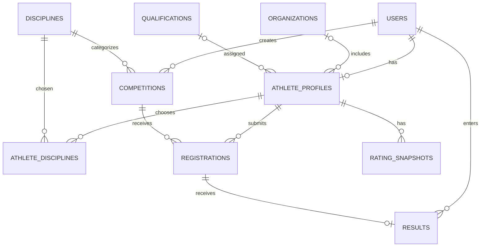

# ТехноСпортФест — 2026: план MVP платформы Федерации спортивного программирования РД

> Рабочий документ команды. Источник требований: [Кейс № 1](https://opentech-design.github.io/technofest.github.io/). Версия плана: 23.09.2026. Подразделы «Решения команды» — наше предложение по реализации, а не дословные требования организатора.

## 1. Цель и границы проекта

Создать работающий веб-сервис, в котором спортсмен регистрируется, заполняет профиль, подаёт заявку на соревнование, организатор видит участника и публикует результат, после чего результат появляется в профиле и влияет на внутренний рейтинг.

**Обязательный демонстрационный путь:**

1. Зарегистрироваться и войти как спортсмен.
2. Заполнить профиль: ФИО, организация, город, дисциплины, разряд при наличии.
3. Открыть карточку соревнования и подать заявку в период регистрации.
4. Войти как организатор, увидеть участника и внести его результат.
5. Опубликовать результат; увидеть его в карточке соревнования и в профиле спортсмена.
6. Открыть рейтинг и показать, из каких баллов он складывается.

Кейс требует сохранять данные, обеспечивать вход минимум под двумя ролями и показывать рабочую бизнес-логику. На первом этапе не нужны компилятор, автоматическая проверка кода, мобильные приложения, интеграция с госуслугами, платные сервисы и промышленная инфраструктура. Новости, документы и календарь допустимо показать как простые информационные страницы; полноценную CMS делать после основного сценария. Финальное дополнительное условие, кейс № 2, будет выдано 26.09.2026, поэтому не связываем все функции в одном сервисе.

## 2. Решения команды для MVP

- Стек: Java, Spring Boot, Spring Data JPA, Spring Security, PostgreSQL, Flyway, React или другой знакомый команде фронтенд. Выбор фронтенда и способа авторизации команда фиксирует перед стартом.
- Один `Competition` относится к одной `Discipline`. Если нужны несколько стартов или номинаций, вводим `CompetitionEvent` позднее.
- Один пользователь имеет одну роль в MVP: `ATHLETE` либо `ORGANIZER`. У спортсмена один профиль, у организатора профиль спортсмена не обязателен.
- Заявка `Registration` — полноценная сущность; пару «соревнование + спортсмен» сохраняем единожды.
- Один опубликованный или черновой `Result` приходится на одну заявку. Создавать и публиковать результат может организатор.
- Квалификация в профиле — текущая, необязательная. Историю изменения разрядов оставляем расширением.
- Рейтинг внутренний, не равен официальному разряду. Его формулу, коэффициенты и пример расчёта команда показывает на защите.
- Сохраняем моменты времени в UTC (`Instant` в Java, `timestamptz` в PostgreSQL), в интерфейсе показываем локальное время.
- Реальные персональные данные третьих лиц не используем; для демонстрации — вымышленные участники.

## 3. Роли и разрешения

| Действие | Гость | ATHLETE | ORGANIZER |
|---|---:|---:|---:|
| Список и карточка соревнований, опубликованные результаты, рейтинг | Да | Да | Да |
| Регистрация и вход | Да | Да | Да |
| Изменить свой профиль | Нет | Да | Нет |
| Подать/отменить свою заявку | Нет | Да | Нет |
| Создать/редактировать соревнование | Нет | Нет | Да |
| Смотреть список участников | Нет | Нет | Да |
| Создать, править и публиковать результаты | Нет | Нет | Да |
| Править справочники | Нет | Нет | Да |

Роль получаем из проверенной сервером учётной записи, а не из переданного клиентом заголовка `Role`. Пароли храним только в виде хешей. Возвращаем DTO, не отдаём JPA-сущности и `passwordHash` прямо в JSON.

## 4. Модель данных: сущности и все поля

Обозначения: `PK` — первичный ключ, `FK` — внешний ключ, `NULL` — допускается отсутствие значения, `UNIQUE` — уникальность. Названия колонок в БД указаны в `snake_case`; в Java — `camelCase`.

### 4.1 `User` → `users`

| Поле Java / колонка | Тип | Назначение и ограничения |
|---|---|---|
| `id` | `Long` | PK, уникальная учётная запись. |
| `email` | `String` | Логин; `NOT NULL`, `UNIQUE`, перед сохранением нормализовать. |
| `passwordHash` / `password_hash` | `String` | Хеш пароля, никогда не возвращать в ответе API. |
| `role` | `UserRole` | `ATHLETE` или `ORGANIZER`; `NOT NULL`, хранить как строку. |
| `createdAt` / `created_at` | `Instant` | Момент создания аккаунта. |

Связи: `User` 1 ↔ 0..1 `AthleteProfile`; `User` 1 ↔ 0..N созданных `Competition`; `User` 1 ↔ 0..N внесённых `Result`. В БД внешние ключи находятся на стороне профиля, соревнования и результата.

### 4.2 `AthleteProfile` → `athlete_profiles`

| Поле Java / колонка | Тип | Назначение и ограничения |
|---|---|---|
| `id` | `Long` | PK профиля. |
| `user` / `user_id` | `User` | FK, `NOT NULL`, `UNIQUE`: один профиль на аккаунт. |
| `fullName` / `full_name` | `String` | ФИО спортсмена; `NOT NULL`. |
| `organization` / `organization_id` | `Organization` | FK, `NULL`: место обучения, если указано. |
| `city` | `String` | Населённый пункт; `NOT NULL` для заполненного профиля. |
| `qualification` / `qualification_id` | `Qualification` | FK, `NULL`: действующий разряд или звание. |
| `createdAt` / `created_at` | `Instant` | Создание профиля. |
| `updatedAt` / `updated_at` | `Instant` | Последнее изменение профиля. |

Связи: к одному `User`; к нулю или одной `Organization` и `Qualification`; к нескольким `Discipline` через `athlete_disciplines`; ко многим `Registration` и `RatingSnapshot`. История результатов извлекается через заявки.

### 4.3 `Organization` → `organizations`

| Поле | Тип | Назначение |
|---|---|---|
| `id` | `Long` | PK организации. |
| `name` | `String` | Официальное или используемое в демо название. |
| `city` | `String` | Населённый пункт организации; не обязан совпадать с городом спортсмена. |

Связь: одна организация — много спортсменов; со стороны `AthleteProfile.organization` это `@ManyToOne`.

### 4.4 `Discipline` → `disciplines`

| Поле | Тип | Назначение |
|---|---|---|
| `id` | `Long` | PK дисциплины. |
| `name` | `String` | Уникальное название. |
| `description` | `String` | Пояснение; может отсутствовать. |

Связи: дисциплина используется многими соревнованиями; много спортсменов выбирают много дисциплин.

### 4.5 `AthleteDiscipline` → `athlete_disciplines`

| Поле Java / колонка | Тип | Назначение |
|---|---|---|
| `athlete` / `athlete_id` | `AthleteProfile` | FK: владелец дисциплины. |
| `discipline` / `discipline_id` | `Discipline` | FK: выбранная дисциплина. |

Составной PK `(athlete_id, discipline_id)` предотвращает повторы. В Java для MVP можно отобразить таблицу через `@ManyToMany` и `@JoinTable` без отдельного класса. Если появятся дата начала занятий или признак основной дисциплины — сделать самостоятельную сущность.

### 4.6 `Qualification` → `qualifications`

| Поле Java / колонка | Тип | Назначение |
|---|---|---|
| `id` | `Long` | PK справочника. |
| `name` | `String` | Уникальное название квалификации. |
| `ratingBonus` / `rating_bonus` | `Integer` | Добавка к внутреннему рейтингу, не значение официального разряда. |
| `sortOrder` / `sort_order` | `Integer` | Порядок отображения. |

Связь: одна квалификация может стоять у многих спортсменов, у спортсмена в MVP максимум одна текущая квалификация.

### 4.7 `Competition` → `competitions`

| Поле Java / колонка | Тип | Назначение и ограничения |
|---|---|---|
| `id` | `Long` | PK соревнования. |
| `title` | `String` | Название в списке и карточке. |
| `level` | `CompetitionLevel` | Уровень, влияет на рейтинг; хранить строкой. |
| `discipline` / `discipline_id` | `Discipline` | FK, дисциплина соревнования; `NOT NULL`. |
| `startsAt` / `starts_at` | `Instant` | Начало. |
| `endsAt` / `ends_at` | `Instant` | Окончание; строго позже начала. |
| `format` | `CompetitionFormat` | `ONLINE`, `OFFLINE`, при необходимости `HYBRID`. |
| `venue` | `String` | Место проведения; `NULL` для онлайн-формата. |
| `description` | `String` | Описание и условия. |
| `status` | `CompetitionStatus` | `UPCOMING`, `ONGOING`, `COMPLETED`, `CANCELLED`. |
| `registrationOpensAt` / `registration_opens_at` | `Instant` | Начало приёма заявок. |
| `registrationClosesAt` / `registration_closes_at` | `Instant` | Конец приёма; позже открытия, обычно не позже начала соревнования. |
| `createdBy` / `created_by_user_id` | `User` | FK на организатора, создавшего соревнование. |

Связи: много соревнований → одна дисциплина и один организатор; одно соревнование → много заявок. `status` — состояние соревнования, а открытость регистрации дополнительно определяется датами.

### 4.8 `Registration` → `registrations`

| Поле Java / колонка | Тип | Назначение и ограничения |
|---|---|---|
| `id` | `Long` | PK заявки. |
| `competition` / `competition_id` | `Competition` | FK на выбранное соревнование. |
| `athlete` / `athlete_id` | `AthleteProfile` | FK на подавшего заявку спортсмена. |
| `status` | `RegistrationStatus` | Для MVP `REGISTERED` либо `CANCELLED`. |
| `registeredAt` / `registered_at` | `Instant` | Дата первой подачи заявки. |

Уникальная пара `(competition_id, athlete_id)`: один спортсмен не подаёт две заявки на одно соревнование. Повторная подача после отмены восстанавливает старую запись и меняет статус, а не добавляет новую. `Registration` — связующая сущность между спортсменом и соревнованием; каждый её FK есть `ManyToOne`.

### 4.9 `Result` → `results`

| Поле Java / колонка | Тип | Назначение и ограничения |
|---|---|---|
| `id` | `Long` | PK результата. |
| `registration` / `registration_id` | `Registration` | FK, `UNIQUE`: максимум один результат на заявку. |
| `place` | `Integer` | Занятое место, положительное число; допускается `NULL`, если места не присваивают. |
| `performanceValue` / `performance_value` | `BigDecimal` | Числовой показатель: время, очки и т. п.; `NULL`, если неприменим. |
| `performanceUnit` / `performance_unit` | `String` | Единица показателя, например `POINTS`, `SECONDS`; `NULL`, если показателя нет. |
| `ratingPoints` / `rating_points` | `Integer` | Баллы за выступление по принятой формуле; начисляются при публикации. |
| `status` | `ResultStatus` | `DRAFT` или `PUBLISHED`; черновик не влияет на рейтинг. |
| `publishedAt` / `published_at` | `Instant` | Момент публикации; `NULL` у черновика. |
| `enteredBy` / `entered_by_user_id` | `User` | FK на организатора, внёсшего результат. |

Связи: заявка 1 ↔ 0..1 результат; организатор 1 ↔ много результатов. Спортсмен, соревнование и дисциплина результата однозначно определяются через `registration → competition`. Не дублировать их FK в `results`.

### 4.10 `RatingSnapshot` → `rating_snapshots`

| Поле Java / колонка | Тип | Назначение |
|---|---|---|
| `id` | `Long` | PK снимка. |
| `athlete` / `athlete_id` | `AthleteProfile` | FK: чей рейтинг пересчитан. |
| `totalPoints` / `total_points` | `Integer` | Итоговые баллы на момент расчёта. |
| `resultPoints` / `result_points` | `Integer` | Часть итога за опубликованные результаты. |
| `qualificationPoints` / `qualification_points` | `Integer` | Часть итога за действующую квалификацию. |
| `calculatedAt` / `calculated_at` | `Instant` | Время пересчёта. |
| `formulaVersion` / `formula_version` | `Integer` | Версия формулы для объяснения исторических снимков. |

У спортсмена может быть много снимков. Для текущего рейтинга выбираем последнюю запись по `(calculated_at DESC, id DESC)`, снимки между собой не суммируем. Если баллы должны измениться при смене квалификации, пересчитываем рейтинг и создаём новый снимок. В БД не хранить одновременно ещё одно независимое поле «текущий рейтинг» без необходимости.

## 5. Диаграмма связей БД



`||` означает ровно одну запись, `o|` — ноль или одну, `o{` — ноль или много. Организация и квалификация в профиле необязательны. Логические `ManyToMany`: спортсмены ↔ дисциплины через `athlete_disciplines`; спортсмены ↔ соревнования через `registrations`. Заявку нельзя заменять голой аннотацией `@ManyToMany`, поскольку у неё есть статус и дата.

### Соответствие полей JPA

| Поле со стороны владельца | JPA-связь | Внешний ключ БД |
|---|---|---|
| `AthleteProfile.user` | `@OneToOne` | `athlete_profiles.user_id UNIQUE` |
| `AthleteProfile.organization` | `@ManyToOne` | `athlete_profiles.organization_id` |
| `AthleteProfile.qualification` | `@ManyToOne` | `athlete_profiles.qualification_id` |
| `AthleteProfile.disciplines` | `@ManyToMany` + `@JoinTable` | `athlete_disciplines(athlete_id, discipline_id)` |
| `Competition.discipline` | `@ManyToOne` | `competitions.discipline_id` |
| `Competition.createdBy` | `@ManyToOne` | `competitions.created_by_user_id` |
| `Registration.athlete` и `.competition` | две `@ManyToOne` | `registrations.athlete_id`, `.competition_id` |
| `Result.registration` | `@OneToOne` | `results.registration_id UNIQUE` |
| `Result.enteredBy` | `@ManyToOne` | `results.entered_by_user_id` |
| `RatingSnapshot.athlete` | `@ManyToOne` | `rating_snapshots.athlete_id` |

Обратные коллекции `@OneToMany` добавляем только там, где реально нужны; для списков участников, результатов и рейтинга чаще удобнее отдельные запросы репозитория с пагинацией. Не помещать в JPA `@Data` и не сериализовать двунаправленный граф объектов напрямую: это предотвращает циклические JSON-ответы.

## 6. Правила рейтинга для демонстрации

Это **предложенная командная формула**, её нужно согласовать до реализации. Для MVP: сумма баллов за опубликованные результаты спортсмена + бонус текущей квалификации. Публикация результата фиксирует вычисленные `Result.ratingPoints`; изменение формулы в дальнейшем требует отдельной процедуры пересчёта.

```text
result_points = place_points × level_multiplier
total_points  = сумма result_points всех опубликованных результатов + qualification_bonus

place_points: 1 место = 100, 2 = 70, 3 = 50, 4–10 = 20, остальные = 5
level_multiplier: чемпионат/Кубок России = 2.0; другое всероссийское = 1.7;
                  межрегиональное = 1.4; чемпионат/Кубок РД = 1.2;
                  другое региональное = 1.0
qualification_bonus: нет разряда = 0; III = 10; II = 20; I = 30;
                     КМС = 50; МС = 80
```

Для MVP заранее закрепить конкретные значения `CompetitionLevel` и соответствие названий справочника разрядов бонусам. Пример: второе место на межрегиональном соревновании даёт `70 × 1.4 = 98`; разряд I добавляет 30; итого при единственном выступлении 128. Если места нет, согласовать правило: например, 0 баллов, а не автоматически «остальные = 5». Минимально рейтинг учитывает уровень соревнования и спортивную квалификацию, как требует кейс; место добавляет третий фактор. Для таблицы рейтинга сортировка по `totalPoints DESC`, при равенстве — по ФИО или иному явно оговорённому правилу.

**Атомарность:** при публикации результата в одной транзакции зафиксировать `PUBLISHED`, `publishedAt`, `ratingPoints`, затем пересчитать и сохранить `RatingSnapshot`. Повторная публикация не должна начислять баллы второй раз. Если результат правят после публикации, пересчитывать рейтинг из всех актуальных опубликованных результатов, а не прибавлять разницу на глаз.

## 7. Структура backend по функциям

```text
src/main/java/<base-package>/
  auth/           # регистрация, вход, роль, безопасность
  athlete/        # профиль, организации, дисциплины, квалификации
  competition/    # карточка, поиск, статусы, управление организатором
  registration/   # заявка, отмена, список участников
  result/         # черновик, публикация, история результатов
  rating/         # формула, пересчёт, таблица лидеров, разбор баллов
  common/         # конфигурация, обработка ошибок, общие типы
src/main/resources/db/migration/  # версионированные SQL-миграции Flyway
```

Внутри модуля: `entity`, `repository`, `service`, `controller`, `dto`, при необходимости `mapper`. Контроллер принимает запрос и возвращает DTO; сервис проверяет права и правила; репозиторий работает с БД. Бизнес-проверки не прятать в контроллер и не доверять значениям `athleteId` и `role`, присланным клиентом для действий «от моего имени».

## 8. Контракт API для согласования фронта и бэка

Маршруты — предложение команды, договориться о них до параллельной разработки. Для списков принять `page=0`, `size=20` по умолчанию и документировать формат ответа.

| Метод и путь | Кто вызывает | Назначение |
|---|---|---|
| `POST /api/auth/register` | Гость | Создать аккаунт спортсмена. Организатора создать тестовым seed или защищённым административным способом. |
| `POST /api/auth/login` | Гость | Войти и получить серверно подтверждённую сессию/токен. |
| `GET /api/athletes/me` | Спортсмен | Получить собственный профиль, дисциплины и текущий рейтинг. |
| `PUT /api/athletes/me` | Спортсмен | Обновить свой профиль. |
| `GET /api/disciplines`, `GET /api/organizations`, `GET /api/qualifications` | Пользователь | Загрузить справочники для форм. |
| `GET /api/competitions` | Все | Список с фильтрами `status`, `disciplineId`, `page`, `size`. |
| `GET /api/competitions/{id}` | Все | Карточка соревнования с опубликованными результатами. |
| `POST /api/competitions`, `PUT /api/competitions/{id}` | Организатор | Создать/изменить соревнование. |
| `POST /api/competitions/{id}/registrations` | Спортсмен | Подать или восстановить свою заявку. |
| `GET /api/athletes/me/registrations` | Спортсмен | Мои соревнования и статусы заявок. |
| `GET /api/competitions/{id}/registrations` | Организатор | Список зарегистрированных участников. |
| `PUT /api/registrations/{id}/cancel` | Спортсмен | Отменить собственную заявку до разрешённого срока. |
| `PUT /api/registrations/{id}/result` | Организатор | Создать/изменить черновик результата. |
| `POST /api/results/{id}/publish` | Организатор | Опубликовать результат и пересчитать рейтинг. |
| `GET /api/athletes/me/results` | Спортсмен | История моих опубликованных результатов. |
| `GET /api/ratings` | Все | Общий рейтинг с пагинацией. |
| `GET /api/athletes/{id}/rating-breakdown` | Все | Состав внутреннего рейтинга спортсмена. |

Типовые ошибки: `400` для неверных полей/дат, `401` без входа, `403` при недостаточной роли, `404` когда запись не найдена, `409` при повторной заявке или конфликте состояния. Сразу договориться о едином JSON-формате ошибок.

## 9. Этапы, задачи и критерии готовности

Сроки с 23 по 26 сентября короткие; порядок фиксирует зависимости. Независимые интерфейсы можно разрабатывать параллельно на согласованных DTO и примерах JSON.

### Этап A — каркас и БД

- [ ] Согласовать MVP, стек, владельцев модулей, формат ответов API и правила веток Git.
- [ ] Создать репозиторий, backend, frontend, локальный запуск одной командой или понятной инструкцией.
- [ ] Поднять PostgreSQL, добавить Flyway-миграцию таблиц, FK, `UNIQUE` и тестовые справочники.
- [ ] Создать демонстрационного организатора и вымышленных спортсменов.

**Готово, когда:** любой участник команды запускает проект по README и видит данные после повторного запуска.

### Этап B — вход и профиль

- [ ] Регистрация спортсмена, вход двух ролей, серверные ограничения доступа.
- [ ] Чтение/изменение своего профиля и выбор нескольких дисциплин.
- [ ] Форма профиля на фронте.

**Готово, когда:** спортсмен сохраняет профиль, а его данные остаются после выхода и входа; роль спортсмена не даёт вызвать API организатора.

### Этап C — соревнования и заявки

- [ ] Организатор создаёт и изменяет соревнование.
- [ ] Список предстоящих/текущих/завершённых и карточка соревнования.
- [ ] Спортсмен подаёт заявку только при открытой регистрации.
- [ ] Список участников организатора и «мои соревнования» спортсмена.

**Готово, когда:** одна заявка видна с обеих сторон, повтор не создаёт дубль, просроченная регистрация отклоняется.

### Этап D — результаты и рейтинг

- [ ] Организатор создаёт черновик и публикует результат существующего участника.
- [ ] Опубликованное видно в карточке соревнования и в профиле.
- [ ] Сервис рейтинга считает баллы и записывает снимок.
- [ ] Таблица рейтинга и расшифровка слагаемых в интерфейсе.

**Готово, когда:** публикация меняет рейтинг ровно один раз; редактирование опубликованного результата даёт корректный пересчёт; черновики не видны спортсмену.

### Этап E — финальная сборка

- [ ] Пройти основной сценарий с чистой БД и двумя учётными записями.
- [ ] Проверить ошибки ролей, повторной заявки, недопустимых дат и публикации несуществующего результата.
- [ ] Подготовить README: запуск, тестовые логины, основные маршруты, формула рейтинга, допущения.
- [ ] Подготовить короткий показ для защиты; оставить время на кейс № 2.

**Готово, когда:** другой участник команды проводит демонстрацию по README без устных подсказок разработчика.

## 10. Разделение работы в команде

Назначьте реальных владельцев после согласования числа участников. При 4 участниках возможна схема:

| Направление | Ответственность | Зависимости |
|---|---|---|
| Backend 1 | Auth, `User`, профиль, справочники, безопасность | Общие миграции и DTO |
| Backend 2 | Соревнования, заявки, результаты, рейтинг | Согласованный контракт API и профиль |
| Frontend | Вход, профиль, список/карточка соревнования, заявки, кабинет организатора, рейтинг | Примеры JSON от backend |
| Интеграция и QA | Миграции, тестовые данные, сборка, сквозная проверка, README и демо | Доступ ко всем веткам |

Если людей меньше, объединить направления, но **назначить одного ответственного за интеграцию**. Параллельные ветки объединять после короткого запуска приложения и проверки основного пользовательского шага. Не ждать последнего дня для первого объединения фронта с API.

## 11. Минимальная проверка перед сдачей

1. После регистрации и повторного входа профиль сохранён.
2. Спортсмен не создаёт соревнование и не публикует результат (`403`).
3. Организатор видит заявку спортсмена; дубликат невозможен (`UNIQUE`).
4. Заявка за пределами времени приёма не проходит.
5. Результат нельзя привязать к спортсмену без заявки.
6. Черновик не влияет на рейтинг, опубликованный результат влияет.
7. Повторная публикация не удваивает баллы.
8. Исправление опубликованного места обновляет рейтинг из актуальных данных.
9. Рейтинг объясняется конкретными результатами и бонусом квалификации.
10. Запуск по README работает после очистки локальной БД и применения миграций.

## 12. Решения, которые команда должна принять сегодня

- [ ] Будет ли соревнование содержать одну дисциплину? В этом плане — да.
- [ ] Какой набор уровней соревнований и квалификаций используется для демонстрации?
- [ ] Нужна ли модерация заявки организатором? В этом плане — нет, регистрация сразу `REGISTERED`.
- [ ] Можно ли отменять и восстанавливать заявку? В этом плане — да, пока открыта регистрация.
- [ ] Можно ли публиковать результаты до `COMPLETED`? В этом плане — нет; при демонстрации сначала завершить соревнование.
- [ ] Какой фронтенд, способ входа и схема локального запуска доступны всей команде?
- [ ] Кто отвечает за API-контракт, миграции, интеграцию и показ на защите?

После утверждения ответов обновите этот файл в проекте, чтобы реализация фронта, бэка и БД опиралась на одну версию правил.
